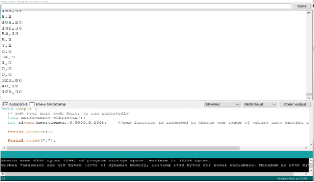
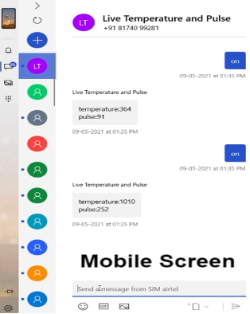
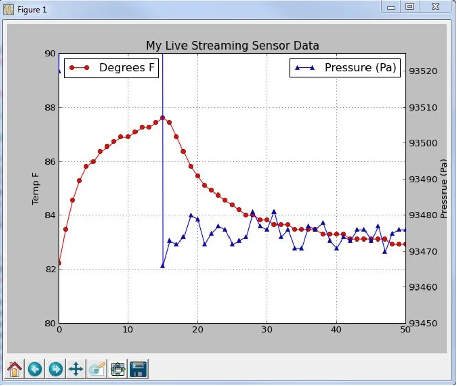
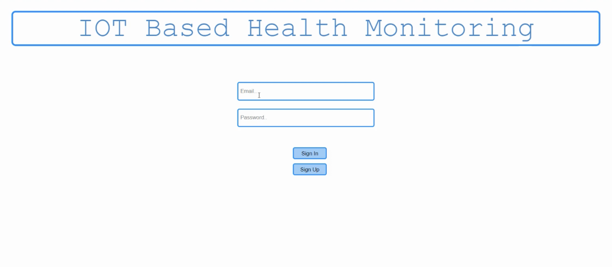
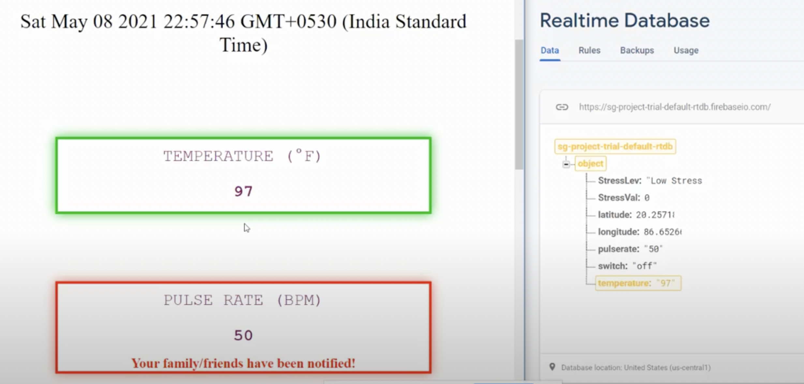
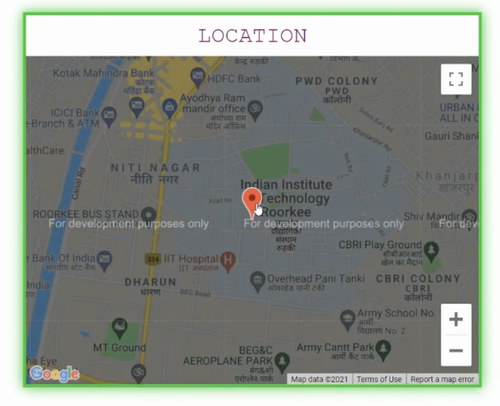

<div align="center"><a href="https://aries-stc.herokuapp.com/" target="_blank"></a>
<a href="https://www.iitr.ac.in/" target="_blank"></a>
</div>

# IoT-based-health-monitoring-system
Recruitment project for 1st yearites


## ARDUINO IDE

>
<br>

>Features
- Realtime temperature and pulse detection of body
- Sending live temperature and pulse values to the user through SMS using GSM module
<br>

>
<br>


## Instructions to run

- Using circuit diagram(mentioned in “Project Report”), connect GSM 900A,temperature sensor  and pulse sensor to Arduino UNO using jumper wires.
- Insert SIM in GSM 900A module.
- Download the “final_code_2.ino” from github and run it on Arduino IDE.
<br><br>

## Conclusions

- Arduino print the temperature and pulse value to serial monitor and these values wil send to firebase using python
- When user sends “on” sms to gsm module,instantly he will get the live temperature  and pulse of body through SMS 
<br><br>

## Arduino-Python Serial Communication,Live location and realtime graph plotting

> Features
- Sending pulse and temperature values to firebase from serial monitor using firebase and serial library
- Realtime graph plotting of sensor values using matplotlib and drawnow library
- Live location of user using web scraping bot.( using selenium library and chrome driver)
<br>

>
<br><br>

## Modules and libraries used
```
$ pip install serial
$ pip install firebase
$ pip install time
$ pip install selenium
$ pip install datetime
$ pip install matplotlib
$ pip install numpy
$ pip install drawnow

```
## Instructions to run
- Installed all the libraries mentioned
- Download the “chromedriver.exe” from github.
- Download the “Main.py” from github and run it.

<br><br>

# Web app

>An app which uses authorization and realtime database from [Firebase](https://firebase.google.com/) to display temperature , Pulse-Rate , Live Location and Live Stress coverage.


## Features
- ###  Authorization
> Uses firesbase Auth to let a user signin , signup or signout using email and password.

>
<br><br>

- ## Temperature and Pulse-Rate

>uses values from firebase-realtime database to show values.

>
<br><br>

- ## Location

>uses Geolocation api to provide the location using latitude and longitude of the user.

>
<br><br>

- ## Stress-Detector 

> <Subtitle>
> An API to detect stress real-time using facial recognition employed by OpenCV, CNN and Flask.

## Features
- Facial Recognition
- Identifying Eyebrows and lip movement 
- Real-time stress calculation
<br><br>

>
<br><br>

## Instructions to run the Web-App
>all the libraries to be installed are given in the reqqs2.txt folder.
```
$ git clone https://github.com/ariesiitr/IoT-based-health-monitoring-system
$ cd web-app
$ pip3 install -r reqqs2.txt
```
> Now go the app.py file and change the template folder path according to your system.

```
$ python3 app.py runserver
```
>copy the local host url, add **/login** at the end and run it on a browser.
<br><br>

## Notification Nodjs

This is a [Nodejs](https://nodejs.org/en/) app which runs on [twilio api](https://www.twilio.com/)

>sends an sms at exceeding levels of temperature and pressure

## Instructions 

>check whether you have nodejs and npm installed otherwise install them first .

```
$ cd notification
$ npm install 
$ node index.js
```


